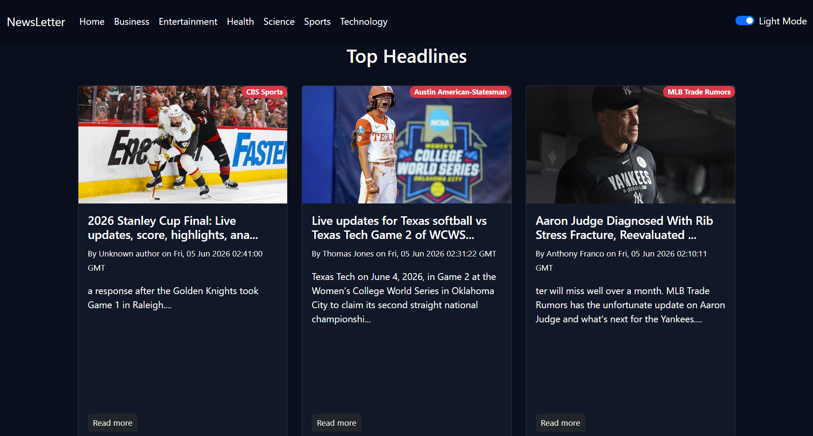

# 📰 react-news-app

A responsive React news aggregator powered by [NewsAPI.org](https://newsapi.org/) that delivers top headlines across multiple categories with infinite scroll and dark mode support.

> ⚠️ **Localhost only** — NewsAPI's free plan restricts API calls to `localhost`. This app will not work when deployed to a live server without upgrading to a paid NewsAPI plan.

---

## 📸 Preview

<!-- Replace with an actual screenshot of your app -->



---

## ✨ Features

- 🗞️ **Top Headlines** — Real-time news from trusted sources via NewsAPI.org
- 📂 **Category Filter** — Browse by Home, Business, Entertainment, Health, Science, Sports, and Technology
- ♾️ **Infinite Scroll** — Seamlessly load more articles as you scroll down
- 🌙 **Dark Mode** — Toggle between light and dark themes
- 📱 **Responsive Design** — Works across desktop, tablet, and mobile screens

---

## 🚀 Getting Started

### Prerequisites

- [Node.js](https://nodejs.org/) v16 or higher
- npm or yarn

### Installation

```bash
# 1. Clone the repository
git clone https://github.com/iamvivekmane/react-learning.git

# 2. Move into the project folder
cd "Day 05/react-news-app"

# 3. Install dependencies
npm install
```

### Environment Variables

Create a `.env` file in the root of the project:

```env
VITE_NEWS_API_KEY=your_newsapi_key_here
```

> Get your free API key at [https://newsapi.org/register](https://newsapi.org/register).  
> Never commit your `.env` file — it is already listed in `.gitignore`.

### Run the App

```bash
npm run dev
```

Open your browser and go to **http://localhost:5173**

---

## ⚠️ API Limitation

This project uses the **NewsAPI.org free plan**, which has the following restriction:

> Requests are only allowed from `localhost`. Any deployment to a public domain (Vercel, Netlify, GitHub Pages, etc.) will return a **426 error** or blocked response.

To make this app publicly deployable, you must upgrade to a [NewsAPI paid plan](https://newsapi.org/pricing).

---

## 📁 Project Structure

```
react-news-app/
├── public/
│   └── vite.svg
├── src/
│   ├── components/        # Navbar, NewsCard, Spinner, etc.
│   ├── App.jsx            # Root component with routing & state
│   └── main.jsx           # App entry point
├── .env                   # API key (not committed)
├── .gitignore
├── index.html
├── package.json
└── README.md
```

---

## 🛠️ Tech Stack

| Tech                                | Purpose              |
| ----------------------------------- | -------------------- |
| [React](https://react.dev/)         | UI framework         |
| [Vite](https://vitejs.dev/)         | Dev server & bundler |
| [NewsAPI.org](https://newsapi.org/) | News data source     |
